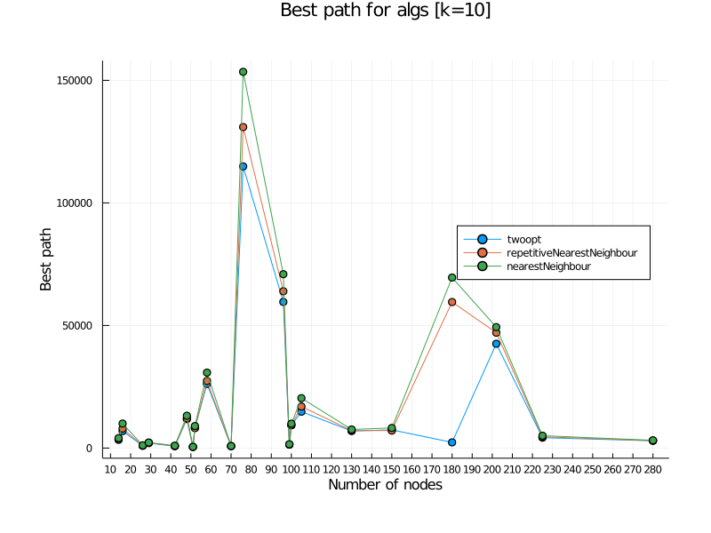
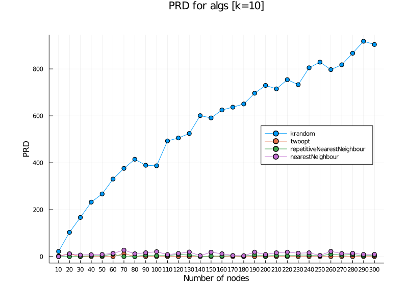
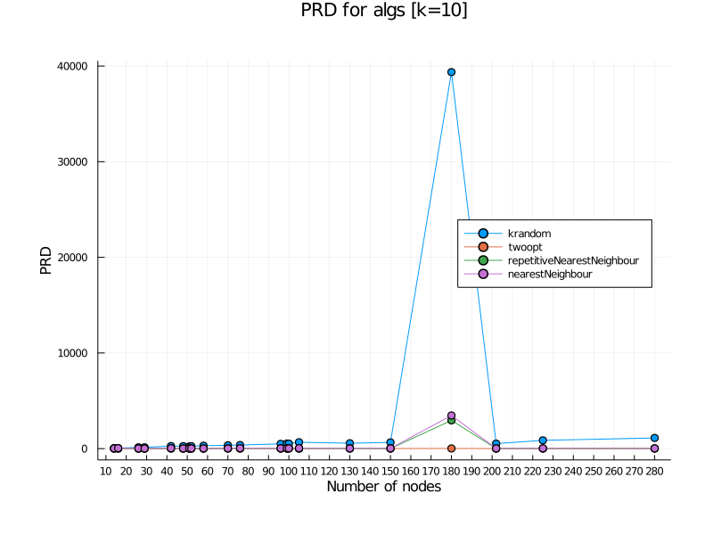
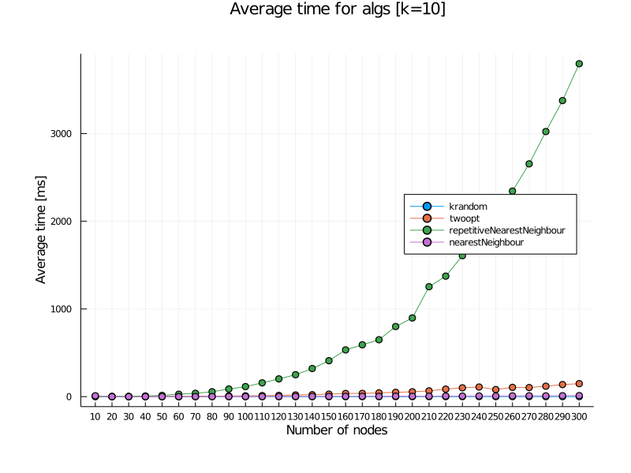
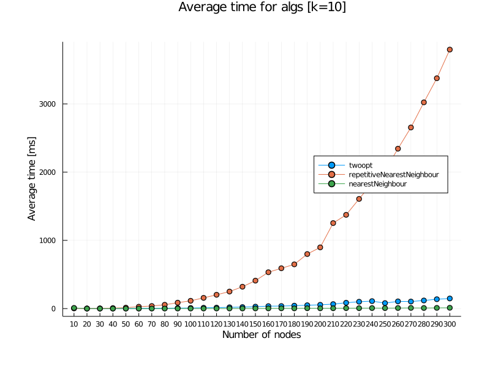
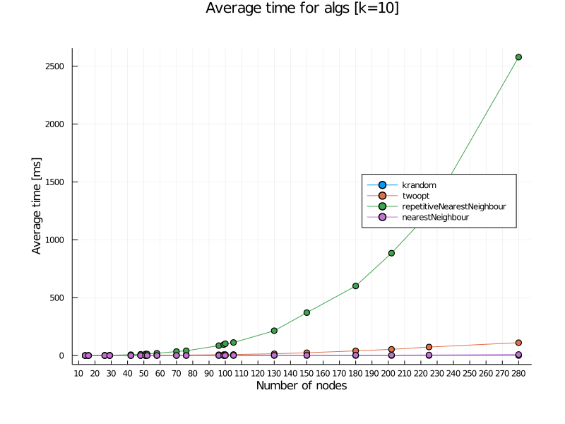

### Sprawozdanie [Etap 1](http://radoslaw.idzikowski.staff.iiar.pwr.wroc.pl/instruction/meta1.pdf)

| Przedmiot  | Algorytmy metaheurystyczne                   |
| ---------- | -------------------------------------------- |
| Prowadzący | Dr inż. Radosław Idzikowski                  |
| Autorzy    | Maciej Bazela (261743) Hubert Gruda (261734) |
| Grupa      | Czwartek 13:15-15:00                         |
| Kod grupy  | K03-66p                                      |
| Język      | Julia                                        |

### Implementacja

Etap 1 polegał na implementacji heurystyk dla [problemu komiwojażera](https://en.wikipedia.org/wiki/Travelling_salesman_problem) oraz zbadaniu ich niektórych własności (czas działania, PRD).

Badaliśmy cztery heurystyki:

- metoda k-random
- metoda [najbliższego sąsiada](https://en.wikipedia.org/wiki/Nearest_neighbour_algorithm)
- rozszerzona metoda najbliższego sąsiada
- algorytm [2-OPT](https://en.wikipedia.org/wiki/2-opt)

Implementacje powyższych algorytmów znajdują się w pliku [algorithms.jl](./algorithms.jl).

Badania przeprowadziliśmy na bibliotece [TSPLIB](http://comopt.ifi.uni-heidelberg.de/software/TSPLIB95/), która zawiera przykładowe dane dla symetrycznego problemu komiwojażera, oraz na losowo generowanych grafach.

Funkcje generujące grafy o symetrycznych (euklidesowych) i asymetrycznych (losowych) wagach znajdują się w pliku [generate.jl](./generate.jl).

### Badania

Pierwszy z testów [BasicTSPTest](./testing.jl#:~:text=BasicTSPTest) polegał na uruchomieniu wybranej heurystyki na podanym datasecie z TSPLIB **k**-razy i wybraniu najlepszej wyliczonej wartości funkcji celu.
Program uruchamiający test wypisywał do konsoli wyliczane po kolei wartości oraz drukował wybraną najlepszą ścieżkę do konsoli oraz pliku w folderze ./plots.

W przypadku problemu komiwojażera, naszą funkcją celu była suma wag pomiędzy kolejnymi węzłami zadanej drogi.

Następne testy polegały na wyliczeniu trzech statystyk dla każdej heurystyki: czas działania danego algorytmu, PRD oraz minimalna wartość funkcji celu dla badanego problemu.

Dla każdej heurystyki wykonywaliśmy k testów na [wybranym przez nas zbiorze danych z TSPLIB](./testing.jl#:~:text=hardcodedData) oraz na losowych grafach z podanego zakresu (i o podanej zmianie wartości ilości miast).

Implementacja badań na predefiniowanym zbiorze plików .tsp znajduje się w funkcji [algorithmsTest](./testing.jl#:~:text=algorithmsTest) w pliku testing.jl.

Te same badania, ale na losowych grafach znajdują się w funkcji
[randomGraphsTest](./testing.jl#:~:text=randomGraphsTest) w tym samym pliku.

### Wyniki

Wyniki testów algorithmsTest oraz randomGraphsTest zapisywaliśmy do formatu .json w folderze [./results/jsons](./results/jsons/).
Rozdzieliliśmy je na 3 różne kategorie:

- [wyniki dla problemów z TSPLIB](./results/jsons/tsplib/)
- [wyniki dla losowych grafów o wagach euklidesowych](./results/jsons/euclidean)
- [wyniki dla losowych grafów o losowych asymetrycznych wagach](./results/jsons/asymmetric/)

Pliki wynikowe zawierają wartości podanych wyżej statystyk (czas, prd, najlepsza wartość funkcji celu) rozdzielone według ilości węzłów dla zadanego problemu.

Przygotowaliśmy dwa programy generujące powyższe pliki .json:

- [./tests/hardcodedTest.jl](./tests/hardcodedTest.jl) generujący wyniki dla predefiniowanego zbioru plików z TSPLIB (patrz: wyżej).
- [./tests/randomgraphsTest.jl](./tests/randomgraphsTest.jl) generujący wyniki dla losowych grafów z zadanego przedziału.

### Wykresy

Dla wygenerowanych wyników napisaliśmy program, który sczytuje pliki .json i dla podanych algorytmów tworzy ich wykresy.

Kod źródłowy można znaleźć w pliku [./tests/plotting.jl](./tests/plotting.jl).

Dla wyników z folderu [./results/jsons](./results/jsons/) wygenerowaliśmy wykresy dla każdego algorytmu. Znajdują się one w folderze [./results/plots](./results/plots/).

### Wnioski

Dla każdej z badanych statystyk wyciągnęliśmy poniższe wnioski:

##### Najlepsza wartość funkcji celu (best generated path):

- przyapdek symetryczny:

  - wszystkie heurystyki:

    

  - bez k-random:

    

- przypadek asymetryczny:

  - wszystkie heurystyki:

    

  - bez k-random:

    

- problemy TSPLIB:

  - wszystkie heurystyki:

    

  - bez k-random:

    

Dla algorytmów k-random i 2-opt przy większej ilości testów otrzymujemy lepsze rozwiązania.
Wynika to z zaimplementowanej losowości w obu algorytmach (k-random dosłownie generuje losową ściężkę, 2opt ulepsza wcześniej losowo wygenerowaną ścieżkę).
Dla obu metod najbliższego sąsiada ilość testów nie wpływa na generowanie lepszego rozwiązania, gdyż nie zawierają one losowości.
Dla każdego algorytmu ilośc wężłów nie wpływa w żaden sposób na generowanie najkrótszej drogi.
Z wykresów można wywnioskować, że najlepsze trasy dla przypadku symetrycznego generował algorytm 2opt, na drugim miejscu rozszerzona metoda sąsiada, będąca minimalnie lepsza od zwykłej metody sąsiada.
Dla przypadku asymetrycznego algorytm 2-opt jest dużo gorszy niż algorytmy najbliższego sąsiada.
W obu przypadkach nieporównywalnie gorsze wyniki otrzymaliśmy od metody k-random.

##### PRD:

- przyapdek symetryczny:

  - wszystkie heurystyki:

    

- problemy TSPLIB:

  - wszystkie heurystyki:

    

PRD określone jest wzorem: (p_gen - p_best) / p_best \* 100%, gdzie:

- p_gen to najlepsza wartość funkcji celu dla danej heurystyki,
- p_best to rozwiązanie optymalne dla zadanego problemu (w przypadku braku informacji o optymalnej ścieżce przyjmowaliśmy p_best jako wartość funkcji celu dla najlepszej heurystyki)

Z badań wynika, że ilość węzłów nie wpływa na PRD. Identycznie jak dla wartości funkcji celu dla najlepszej wygenerowanej ścieżki, najlepszy jest alogrytm 2-opt, druga jest rozszerzona metoda sąsiada, trzecia zwykła metoda sąsiada, a na samym końcu k-random.

##### Time Complexity:

- przyapdek symetryczny:

  - wszystkie heurystyki:

    

  - bez k-random:

    

- przypadek asymetryczny:

  - wszystkie heurystyki:

    

  - bez k-random:

    

- problemy TSPLIB:

  - wszystkie heurystyki:

    

  - bez k-random:

    

Dla badanych heurystyk oszacowaliśmy ich złożoności obliczeniowe:

- k-random O(kn), gdzie k to ilośc losowo generowanych permutacji, a n to wielkość danych wejściowych (węzłów).
- metoda najbliższego sąsiada O(n^2), gdyż dla każdego węzła musimy sprawdzić do n-1 innych węzłów.
- metoda rozszerzonego najbliższego sąsiada O(n^3), gdyż przechodzimy przez metodę najbliższego sąsiada tyle razy ile mamy węzłów, czyli n razy.
- algorytm 2-opt O(n^3), liczenie drogi (koszt O(n)) dla każdego możliwego przestawienia dwóch par węzłów z wejściowej drogi.
