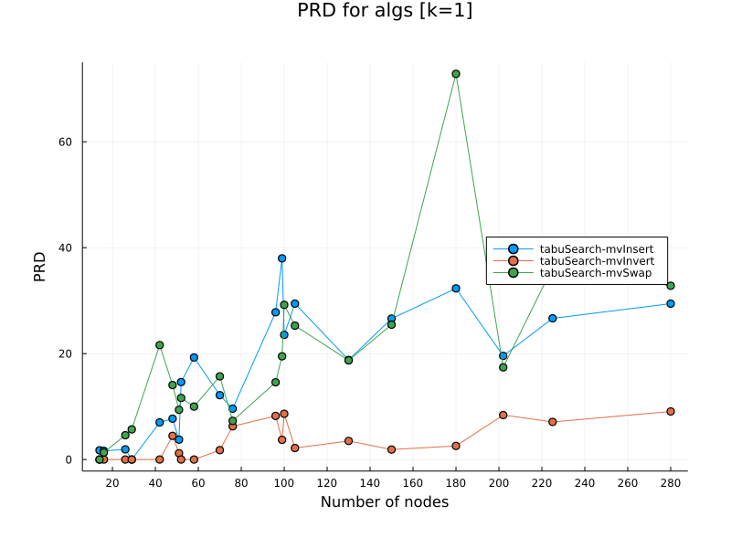
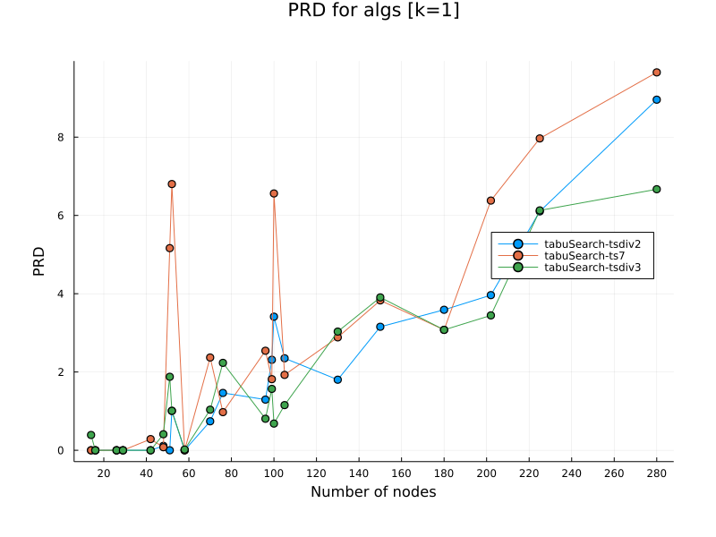
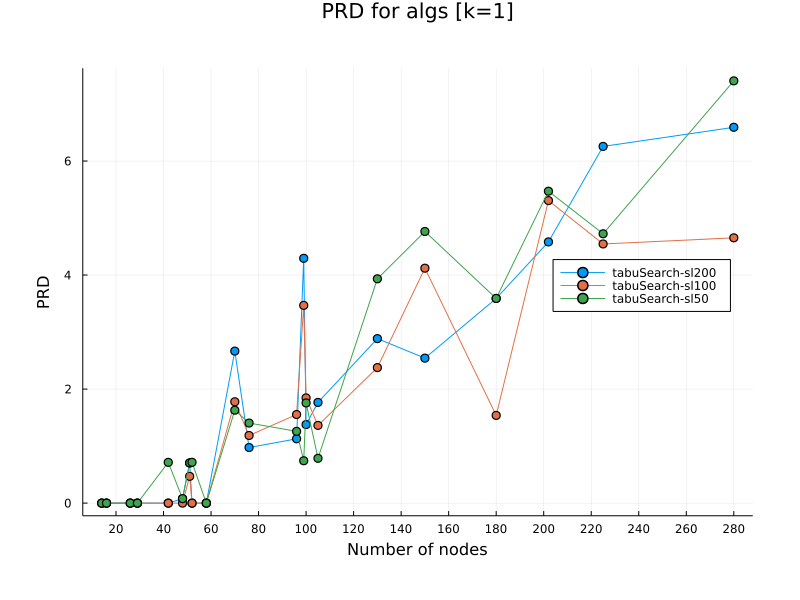
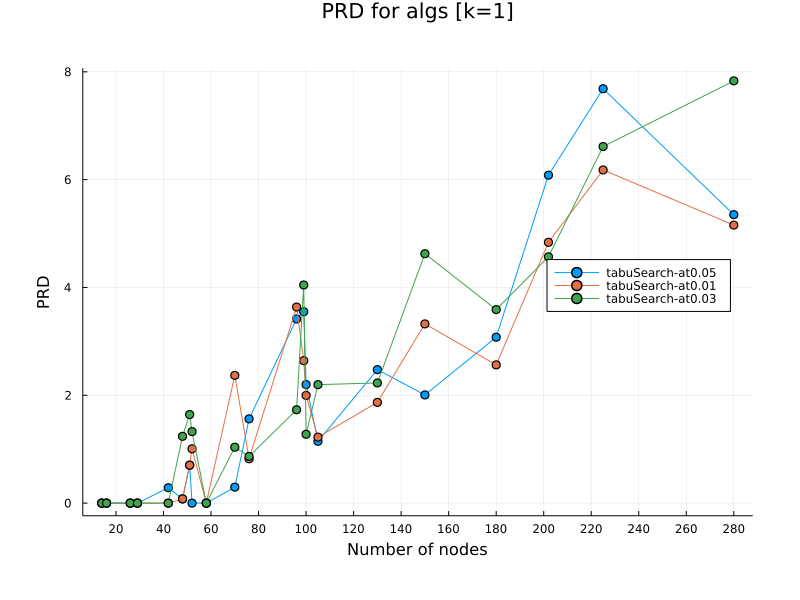
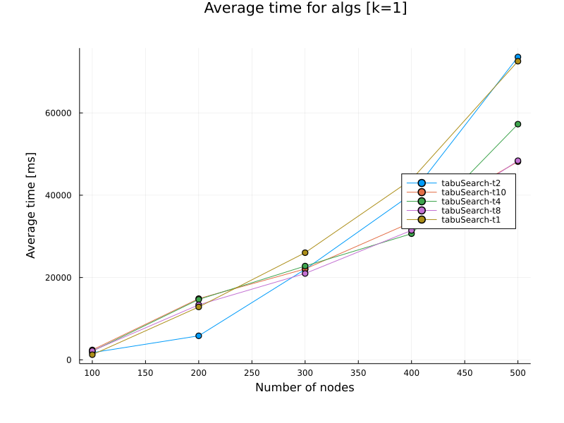
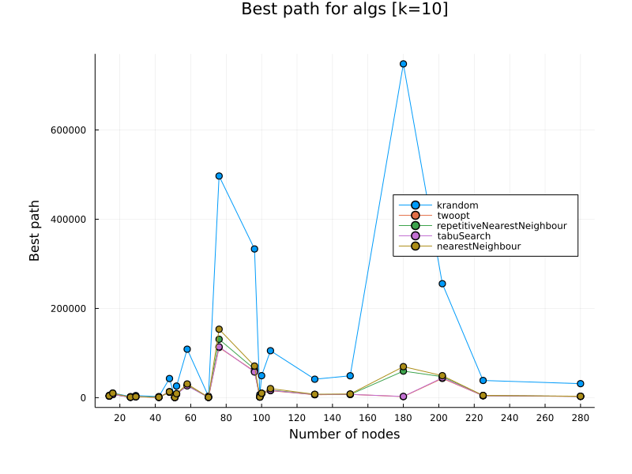
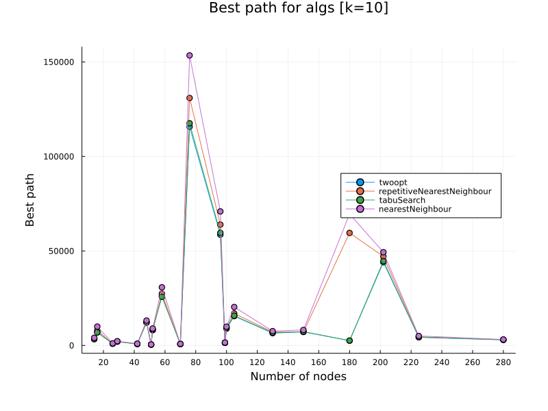
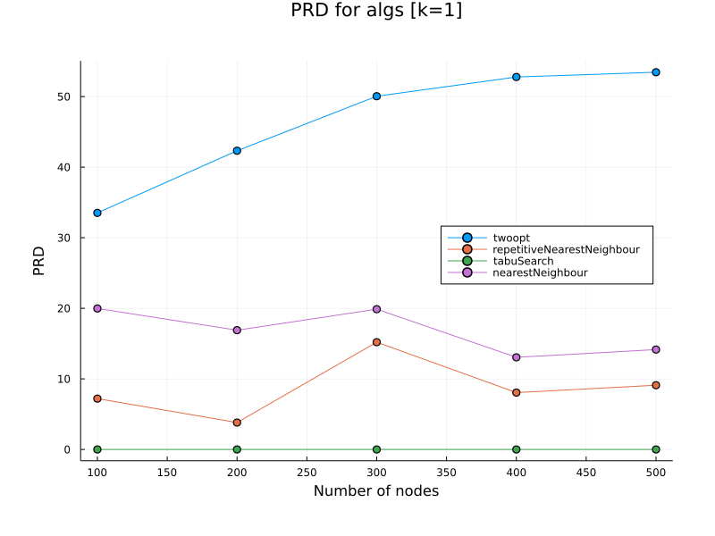
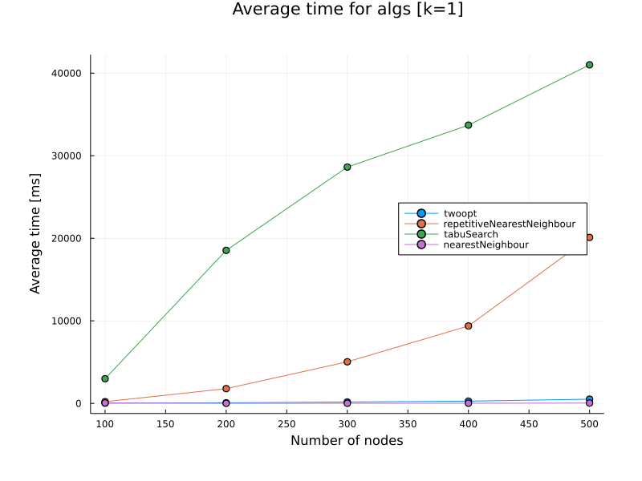

### Sprawozdanie [Etap 1](http://radoslaw.idzikowski.staff.iiar.pwr.wroc.pl/instruction/meta2.pdf)

| Przedmiot  | Algorytmy metaheurystyczne                   |
| ---------- | -------------------------------------------- |
| Prowadzący | Dr inż. Radosław Idzikowski                  |
| Autorzy    | Maciej Bazela (261743) Hubert Gruda (261734) |
| Grupa      | Czwartek 13:15-15:00                         |
| Kod grupy  | K03-66p                                      |
| Język      | Julia                                        |

### Implementacja

Etap 2 polegał na implementacji przeszukiwania z zabronieniami (Tabu Search) dla [problemu komiwojażera](https://en.wikipedia.org/wiki/Travelling_salesman_problem) oraz zbadaniu jego niektórych własności (czas działania, PRD).

Implementacja Tabu Searcha znajduje się w: [./tabuSearch.jl](./tabuSearch.jl).

Badania przeprowadziliśmy na bibliotece [TSPLIB](http://comopt.ifi.uni-heidelberg.de/software/TSPLIB95/), która zawiera przykładowe dane dla symetrycznego problemu komiwojażera, oraz na losowo generowanych grafach.

Funkcje generujące grafy o symetrycznych (euklidesowych) i asymetrycznych (losowych) wagach znajdują się w pliku [generate.jl](../1/generate.jl).

### Badania

Badania przeproawdziliśmy na [takich samych instancjach TSPLIB](./testing.jl#:~:text=hardcodedData) jak w etapie 1 oraz na losowo generowanych danych (dla wag euklidesowych).

Badania polegały na uruchomieniu Tabu Searcha dla danych parametrów, zbadanie czasu działania dla zadanej liczby iteracji (nie testowaliśmy kryterium stopu w postaci czasu działania), najlepszej wartości funkcji celu oraz PRD dla danego problemu.

Aby Tabu Search działał optymalnie, musieliśmy go najpierw "nastroić" (dobrać odpowiednie parametry).

W naszym przypadku strojenie polegało na włączaniu heurystyki dla zadanych parametrów, porównaniu wartości PRD i wybranie najlepszych parametrów dla przyszłych testów.

Po kolei testowaliśmy:

- rodzaj ruchu,
- wielkość listy tabu,
- wielkość pamięci długoterminowej,
- liczba iteracji, zanim uznajemy, że została wykryta stagnacja,
- maksymalne dopuszczalne odchylenie od najlepszego rozwiązania używane w mechanizmie aspiracji,
- liczba wątków użytych w czasie działania programu.

Wszystkie badania uruchamiane są z programu [./main.jl](./main.jl) przy pomocy odpowiednio dobranych argumentów w linii komend (więcej informacji znajduje się w pliku).

Dla ułatwienia, przygotowaliśmy skrypty w bashu ([./tests.sh](./tests.sh), [./2nd-tests.sh](./2nd-tests.sh)), które uruchamiają po kolei powyższe badania strojeniowe.

Kiedy wyznaczyliśmy optymalne parametry dla naszej heurystyki porównaliśmy ją z poprzednio zaimplementowanymi heurystykami, które badaliśmy podczas etapu 1 (2-opt, nearest neighbour, repetitive nearest neighbour, k-random).

### Wyniki

Wyniki testów algorithmsTest oraz randomGraphsTest zapisywaliśmy do formatu .json w folderze [./results/jsons](./results/jsons/).

Pliki wynikowe zawierają wartości podanych wyżej statystyk (czas, prd, najlepsza wartość funkcji celu) rozdzielone według ilości węzłów dla zadanego problemu.

### Wykresy

Dla wygenerowanych wyników napisaliśmy program, który sczytuje pliki .json i dla podanych algorytmów tworzy ich wykresy.

Kod źródłowy można znaleźć w pliku [./tests/plotting.jl](./tests/plotting.jl).

Dla wyników z folderu [./results/jsons](./results/jsons/) wygenerowaliśmy wykresy dla każdego algorytmu. Znajdują się one w folderze [./results/plots](./results/plots/).

### Wnioski

#### Strojenie

##### Najlepszy rodzaj ruchu (PRD):

Jak widzimy, ruch typu **invert** druzgocąco polepsza znajdywane rozwiązania.

Rozwiązania znajdywane przy użyciu ruchu **invert** są bliskie rozwiązaniom optymalnym.

##### Najlepsza wielkość listy tabu (PRD):

W przypadku TSPLIB wielkość listy tabu powinna być liniowo uzależniona od wielkości zadanego problemu. Dlatego dla reszty badań przyjęliśmy, że wielkość listy tabu równa się **połowie liczby węzłów** w danym problemie.

##### Najlepsza wielkość pamięci długoterminowej (PRD):

Tak samo jak w przypadku wielkości listy tabu, wielkość pamięci długoterminowej powinna być uzależniona liniowo od ilości węzłów danego problemu. Tutaj także przyjęliśmy, że backtrack_size = **liczba_węzłów / 2**.

##### Liczba iteracji zanim uznajemy stagnację (PRD):

Limit liczby iteracji, które nie poprawiają nam dotychczasowego rozwiązania ustawialiśmy w zależności od liczby badanych iteracji. Dla każdego wybranego problemu z TSPLIB wybieraliśmy kolejno jako limit stagnacji w 5%, 10% albo 20% liczby wszystkich iteracji (np. dla 1000 iteracji, mielibyśmy kolejno: 50 iteracji, 100 iteracji i 200 iteracji zanim uznamy, że wykryliśmy stagnację).

Dla **10%** wszystkich iteracji osiagaliśmy najlepsze PRD.

##### Odchylenie od najlepszego rozwiązania użyte w mechanizmie aspiracji (PRD):

Nasze kryterium aspiracji polegało na sprawdzaniu, czy wybrany zabroniony ruch nie polepsza nam dotychczasowego najlepszego rozwiązania z jakimś marginesem błędu.

Margines ten określaliśmy jako **aspiration_threshold**, który jest floatem od 0.0 do 1.0.

Np. dla aspiration_threshold = 0.05 dopuszczaliśmy rozwiąznia, które są lepsze od **(1-0.05) \* the_bestest_distance**, czyli te, które są maksymalnie o **5%** gorsze od dotychczasowego.

Przyjęliśmy 3 różne warianty odchylenia: **1%**, **3%**, **5%**.

Dla **1%** mechanizm aspiracji zachowywał się najlepiej.

##### Liczba wątków, a czas działania dla n liczby iteracji:

Zbadaliśmy od jakiego momentu opłaca się zrównoleglać badanie przeszukiwanie sąsiedstwa w tabu search.

Dla małych instancji nie ma to sensu, ponieważ nasz kod jest na tyle zoptymalizowany, że włączenie i usypianie wątków wydłuża czas, zamiast go skracać.

Na wykresie możemy zobaczyć, że dla problemów mających około **300** węzłów zaczynamy odczuwać realną różnicę w czasie działania naszej heurystyki.

#### Porównanie z innymi heurystykami

##### Wybrane instancje z TSPLIB:

Tabu serach jest jedną z najlepszych heurystyk dla problemów z TSPLIB, chociaż, jak możemy zauważyć, nie zawsze poprawia on rozwiązania względem 2-opt.

Jako rozwiązanie startowe przyjmowaliśmy zawsze ścieżkę z 2-opt i możliwe, że liczba iteracji była zbyt mała, zanim dotarliśmy do rzeczywiście dużo lepszych rozwiązań.

Wyniki prezentują się dużo lepiej dla losowych instancji problemu TSP.

##### Losowe instancje, euklidesowe wagi:

Tabu search znajduje najlepsze rozwiązania dla losowych instancji, przebijając wszystkie poprzednie heurystyki.

Niestety dzieję się to wszystko kosztem czasu działania. Tabu Search jest najwolniejszy z wszystkich heurystyk.
