### Sprawozdanie [Etap 3](http://radoslaw.idzikowski.staff.iiar.pwr.wroc.pl/instruction/meta3.pdf)

| Przedmiot  | Algorytmy metaheurystyczne                   |
| ---------- | -------------------------------------------- |
| Prowadzący | Dr inż. Radosław Idzikowski                  |
| Autorzy    | Maciej Bazela (261743) Hubert Gruda (261734) |
| Grupa      | Czwartek 13:15-15:00                         |
| Kod grupy  | K03-66p                                      |
| Język      | Julia                                        |

### Implementacja

Etap 3 polegał na implementacji algorytmu populacyjnego (wybraliśmy algorytm oparty na sztucznej koloni pszczół) dla [problemu komiwojażera](https://en.wikipedia.org/wiki/Travelling_salesman_problem) oraz zbadaniu jego niektórych własności (czas działania, PRD).

Implementacja Sztucznej Kolonii Pszczół znajduje się w: [./artificial_bee_colony.jl](./artificial_bee_colony.jl).

Badania przeprowadziliśmy na bibliotece [TSPLIB](http://comopt.ifi.uni-heidelberg.de/software/TSPLIB95/), która zawiera przykładowe dane dla symetrycznego problemu komiwojażera.

Funkcje generujące grafy o symetrycznych (euklidesowych) i asymetrycznych (losowych) wagach znajdują się w pliku [generate.jl](../1/generate.jl).

### Badania

Badania przeproawdziliśmy na [takich samych instancjach TSPLIB](./testing.jl#:~:text=hardcodedData) jak w etapie 1 oraz 2.

Badania polegały na uruchomieniu Artifical Bee Colony dla danych parametrów, a następnie zbadaniu najlepszej wartości funkcji celu oraz PRD dla danego problemu.

Aby nasz algorytm działał optymalnie, musieliśmy go najpierw "nastroić" (dobrać odpowiednie parametry).

W naszym przypadku strojenie polegało na włączaniu heurystyki dla zadanych parametrów, porównaniu wartości PRD i wybranie najlepszych parametrów dla przyszłych testów.

Po kolei testowaliśmy:

- liczba generowanych pszczół,
- limit odwiedzeń pojedyńczego kwiatka,
- limit odwiedzeń pojedyńczego kwiatka względem liczby pszczół,
- rodzaj selekcji,
- rodzaj swarmu,
- liczba wątków
- liczba wątków względem liczby pszczół.

Wszystkie badania uruchamiane są z programu [./main.jl](./main.jl) przy pomocy odpowiednio dobranych argumentów w linii komend (więcej informacji znajduje się w pliku).

Dla ułatwienia, przygotowaliśmy skrypty w bashu [./tests.sh](./tests.sh), które uruchamiają po kolei powyższe badania strojeniowe.

Kiedy wyznaczyliśmy optymalne parametry dla naszej heurystyki porównaliśmy ją z poprzednio zaimplementowanymi heurystykami, które badaliśmy podczas wcześniejszych etapów (2-opt, nearest neighbour, repetitive nearest neighbour, k-random, tabu search).

### Wyniki

Wyniki testów algorithmsTest oraz randomGraphsTest zapisywaliśmy do formatu .json w folderze [./results/jsons](./results/jsons/).

Pliki wynikowe zawierają wartości podanych wyżej statystyk (czas, prd, najlepsza wartość funkcji celu) rozdzielone według ilości węzłów dla zadanego problemu.

### Wykresy

Dla wygenerowanych wyników napisaliśmy program, który sczytuje pliki .json i dla podanych algorytmów tworzy ich wykresy.

Kod źródłowy można znaleźć w pliku [./plotting.jl](./plotting.jl).

Dla wyników z folderu [./jsons](./jsons/) wygenerowaliśmy wykresy dla każdego algorytmu. Znajdują się one w folderze [./plots](./plots/).

### Wnioski

#### Strojenie

##### Najlepsza ilość pszczół (PRD):

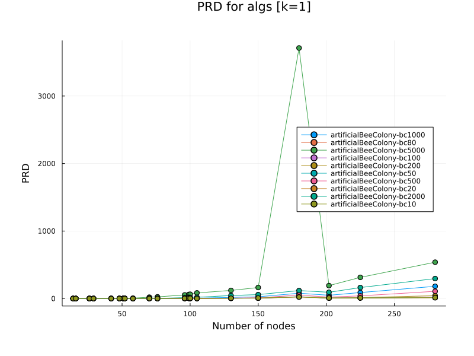

Jak widzimy, im **mniejsza** ilość pszczółek, tym lepsze znajdywane rozwiązania.

Jednakże bliskie optymalnemu są też liczby pszczółek do 500 generowanych pszczółek.

##### Limit odwiedzeń pojedyńczego kwiatka (PRD):

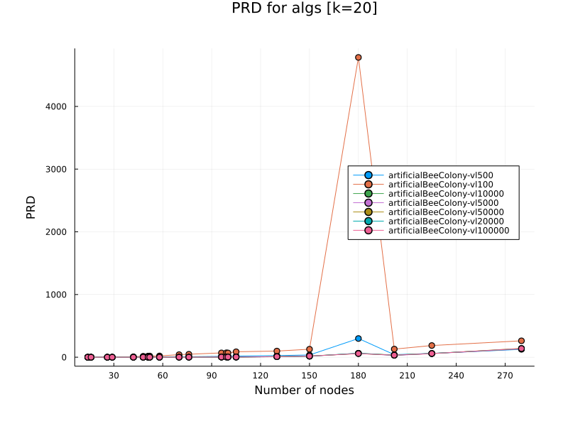

Dla limitu **100** i **500** widać znaczne różnice. Dla większych ilości limitów **nie widać** większej różnicy.

##### Limit odwiedzeń pojedyńczego kwiatka względem ilości pszczół (PRD):

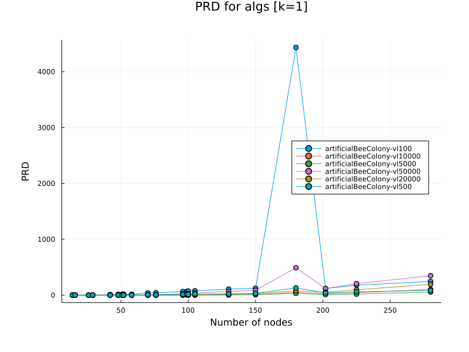

Dla dobranych ilości generowania pszczółek względem limitu odwiedzeń widać, że najlepiej w parze idzie **500** pszczół wygenerowanych na **5000** limitu odwiedzeń. Na drugim miejscu możemy ustalić **1000** psczół na **10 000** limitu odiwedzeń. Widać, że znacznie odstaje **5000** pszczół **50 000** limitu oraz **100** pszczół na **100** limitu.

##### Rodzaj selekcji (PRD):

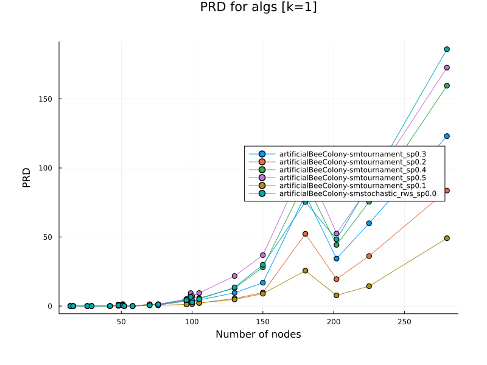

Wbrew naszym przewidywaniom, najlepszym rodzajem selekcji okazał się być **tournament**, a nie **ulepszona ruletka**.

Widać również, że im **mniejszy paramter** w turnieju tym lepsze wyniki.

#### Odchylenie od najlepszego rozwiązania użyte w mechanizmie aspiracji (PRD):

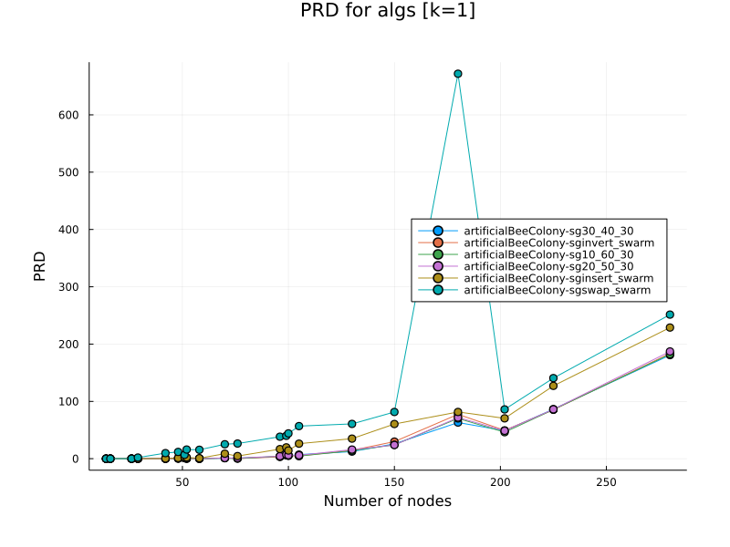

W tym przypadku sprawdzaliśmy, jak typ ruchu wykonywany przez pszczółki wpływa na znalezione rozwiązanie. Mamy 3 określone ruchy: swap, invert oraz insert. Możemy również podać proporcje ruchów.

Znacząco odstają pszczółki wygenerowane przez same **swapy** i **inserty**.
Najlepszym rozwiązaniem wydaje się być proporcje: **30%** pszczółek typu swap, **40%** typu invert i pozostałe **30%** typu insert.

#### Liczba wątków (PRD):

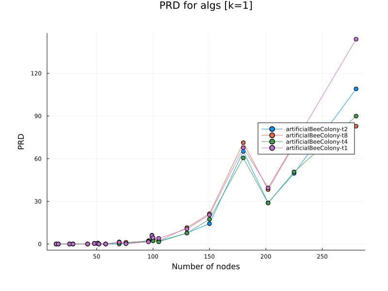

Zbadaliśmy kiedy opłaca się przełączać na wielowątkowość.

Dla małych instancji nie ma to sensu, ponieważ nasz kod jest na tyle zoptymalizowany, że włączenie i usypianie wątków wydłuża czas, zamiast go skracać.

Na wykresie możemy zobaczyć, że dla problemów mających około **100** węzłów zaczynamy odczuwać realną różnicę i najbardziej optymalnym rozwiązaniem jest włączenie **2** wątków. W okolicach problemu o rozmiarze **200** węzłów warto przełączyć się na **4** wątki, a dla powyżej **250** węzłów możemy śmiało użyć 8 wątków.

#### Liczba wątków a liczba pszczół (PRD):

Zbadaliśmy kiedy opłaca się przełączać na wielowątkowość, ale tym razem zmienialiśmy ilość generowanych pszczół kolejno dla **1000**, **5000**, **10 000**.

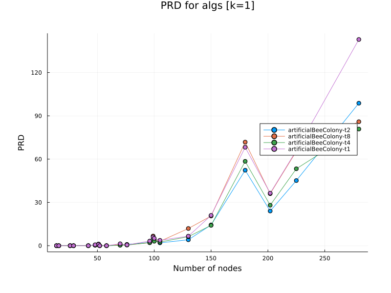

Dla **1000** wygenerowanych pszczół, dla problemów wielkości około **120** węzłów opłaca przełączyć się na **2** wątki, a przy przekroczeniu **250** węzłów lepszym rozwiązaniem będą **4** wątki.

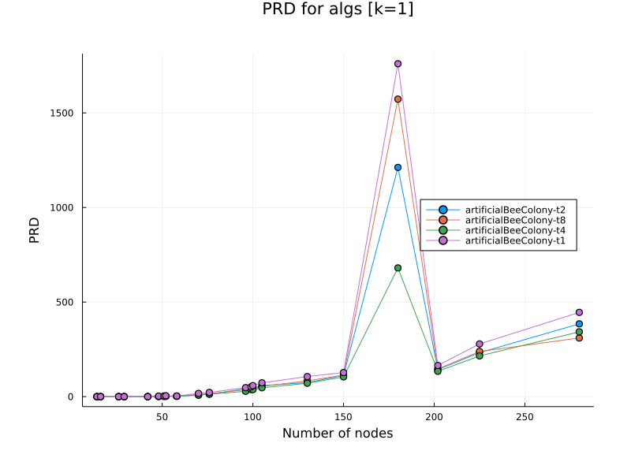

Dla **5000** wygenerowanych pszczół, już przy wielkości około **100** węzłów opłaca przełączyć się od razu na **4** wątki, a przy przekroczeniu około **300** węzłów lepszym rozwiązaniem będą **8** wątki.

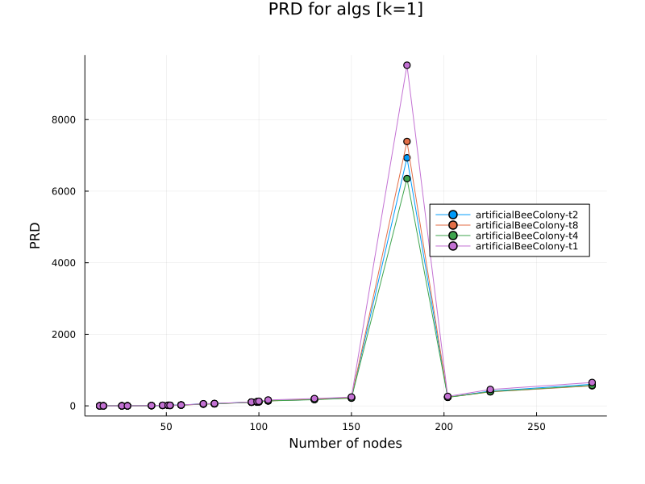

Dla **10 000** wygenerowanych pszczół najlepiej będzie zachować sie tak samo jak dla **5000** pszczół.

#### Porównanie z Tabu Search

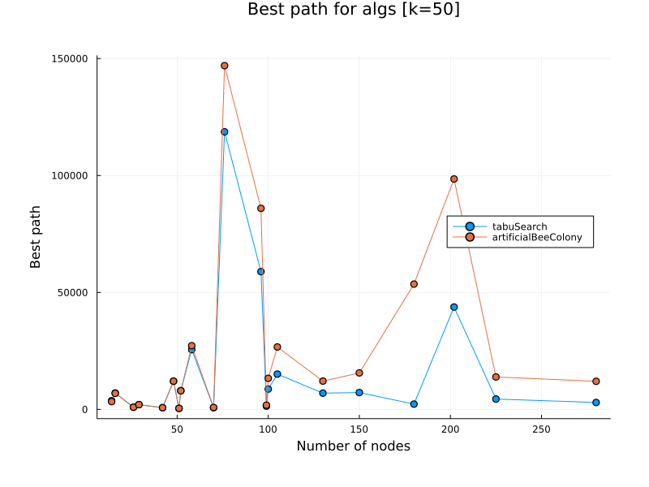
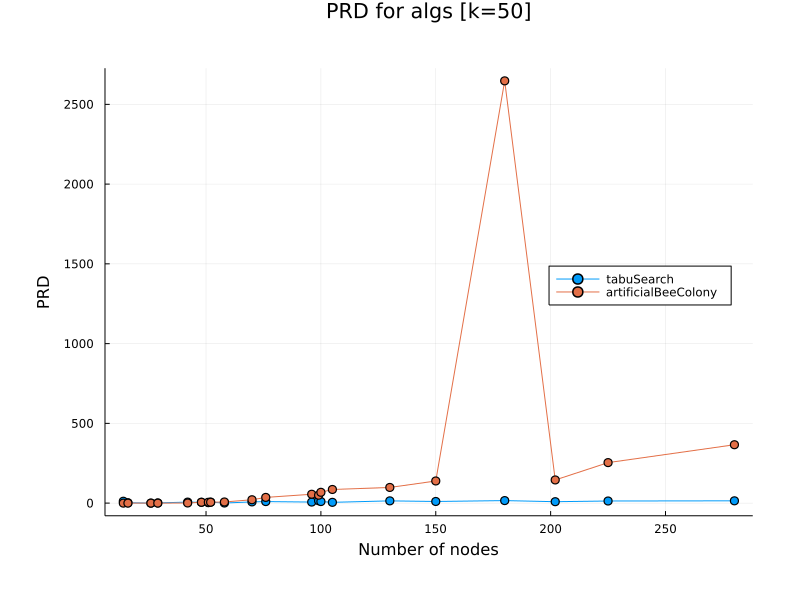
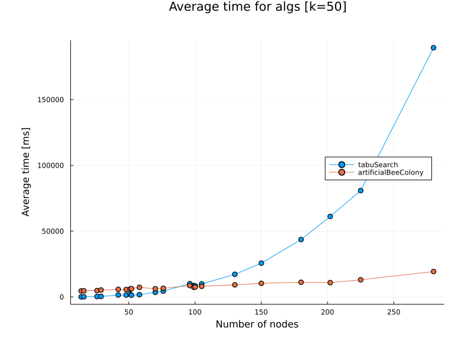

W bezpośrednim starciu testowany algorytm nie ma szans. Jedynym atutem wydaje się być utrzymująca funkcja czasu, gdyż dla tabu Searcha znacznie on wzrasta w porównaniu do naszego algorytmu.

#### Porównanie ze wszystkimi algorytmami

###### 120 sekund dla małej ilości pszczół

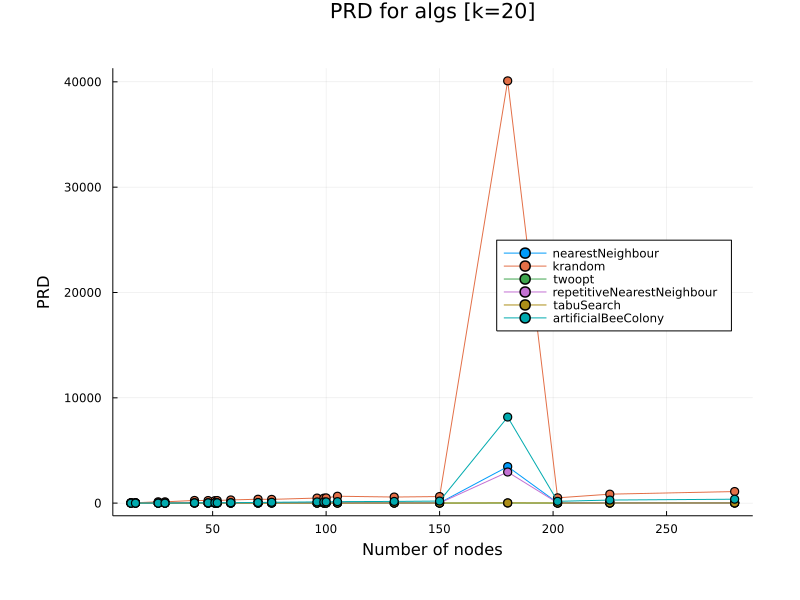

Dla małej ilości pszczół, nasz algorytm znacząco odstaje od pozostałych (pomijając k-randoma).

###### 2000 iteracji dla małej ilości pszczół

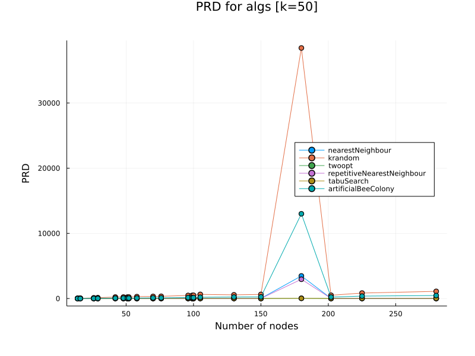

Tak jak wyżej możemy zauważyć, że nasz algorytm odstaje od pozostałych (pomijając k-randoma).

###### 2000 iteracji

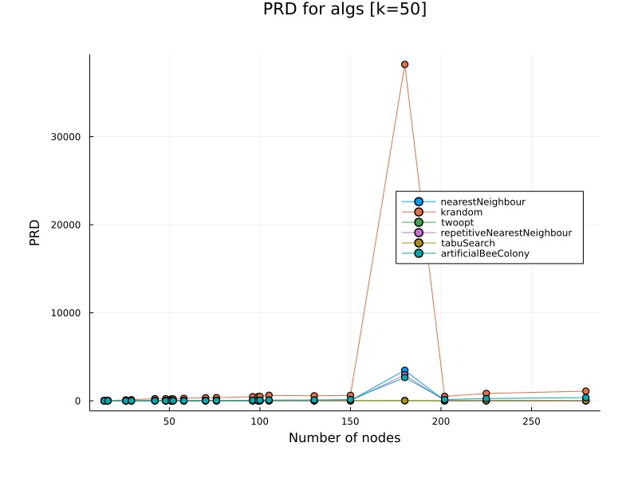

Tutaj widoczna jest zmiana. Nasz algorytm w końcu daje lepsze wyniki od pozostałych algorytmów. Oczywiście dalej nie jest w stanie przebić Tabu Searcha.
